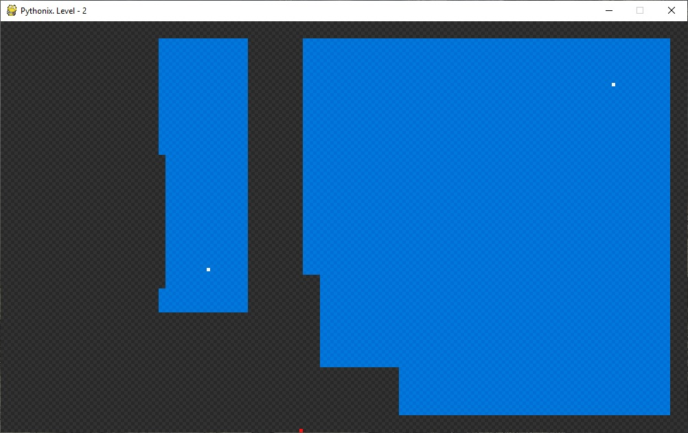
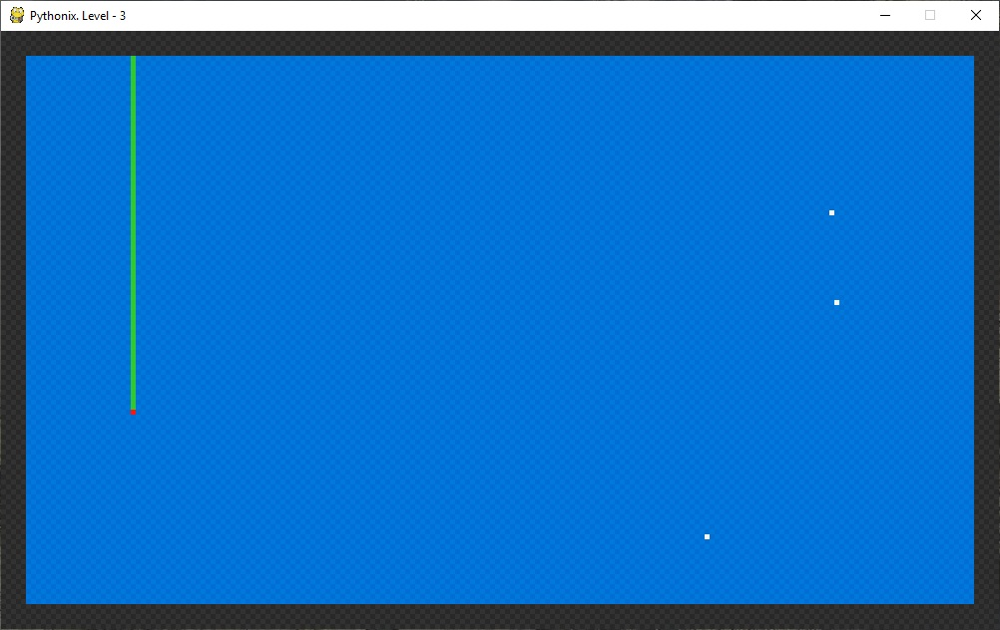
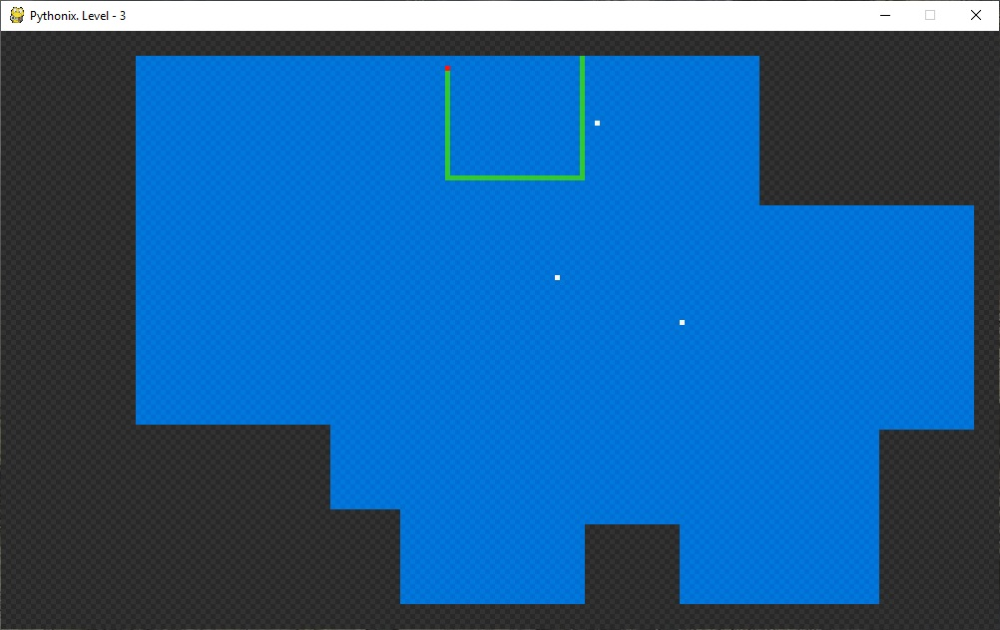
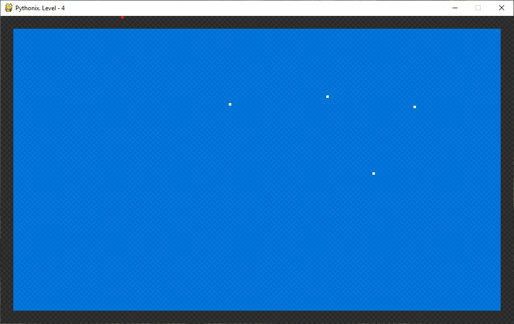
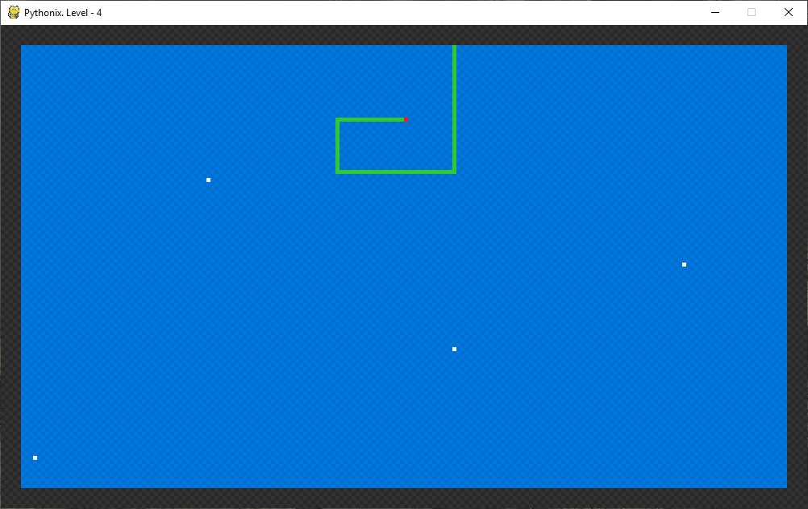

# Pythonix

Клон игры Xonix на языке Python.
Суть игры в том, чтоб, управляя курсором, отрезать от игрового поля - "моря" - кусочки до тех пор пока площадь моря не уменьшится до четверти от первоначальной. По самому морю двигаются точки - "корабли" - которые стремятся помешать игроку. Курсор двигаясь по морю оставляет за собой след, разделяющий море и уязвимый для кораблей-противников. Если точка-корабль врежется в курсор или его след - уровень считается проигранным и начинается с начала. Также игрок не должен сам врезаться в свой след. Как только курсор переходит с моря на "сушу", его след превращается в новую сушу, и если при этом в море появилась замкнутая область, не содержащая кораблей, то она удаляется.
При переходе на следующий уровень каждый раз добавляется еще один корабль.

Для начала игры необходимо запустить файл start_game.pyw

В пакете game_pack находятся следующие файлы:
pythonix.py - отвечает за прием команд от игрока и отрисовку игрового поля
params.py - содержит параметры игры (цвета, размер поля, коды клеток и т.д.)
board.py - хранит игровое поле и двигает по нему курсор игрока и вражеские "корабли". Также отвечает за определение условий победы или поражения.
player.py - содержит класс, описывающий игрока (его координаты и направление движения)
sparkle.py - содержит класс, описывающий врагов (их координаты и направление движения)

Скриншоты ниже:

